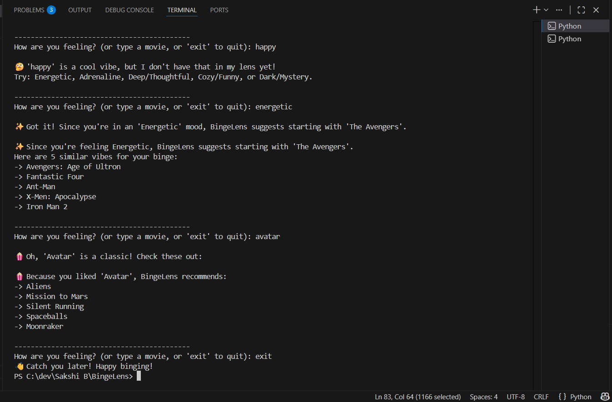

<h1 align="center">🍿 BingeLens</h1>

  <b>Solving "Choice Paralysis" with Machine Learning</b>

 

### **🔍 What is this?**
Ever spent two hours scrolling through Netflix only to end up watching nothing? Yeah, me too. I built **BingeLens** to fix that "choice paralysis." It’s a movie recommender that doesn't just look at a genre—it looks at the **"vibe"** of a movie (the tags, the plot, and the keywords) and matches it to your current mood.

 

### **🧠 How I built the "Brain"**
The project uses **Machine Learning** (specifically a Content-Based Filtering approach). Here’s the breakdown of how it actually works under the hood:

* **The Messy Part (Data Cleaning):** The raw TMDB data was a nightmare. It had JSON strings inside CSV columns and was buried in nested ZIP files. I wrote a pipeline to extract the genres and keywords and merge them into one giant **"Tag Soup"** for every movie.
* **Turning Words into Numbers:** Computers can't "read," so I used `CountVectorizer`. It takes the 5,000 most frequent words in my dataset and turns every movie into a **mathematical vector** (a point in space).
* **The Logic (Cosine Similarity):** This is the "Search" part. When you pick a movie or a mood, the app calculates the **Cosine Similarity** (the angle) between that movie and every other movie. The smaller the angle, the more similar the vibe.

 

### **🛠️ Tech Stack**
**Python 3.12** — The backbone of the logic  
**Pandas** — For all the data heavy lifting  
**Scikit-Learn** — For the Vectorization and Similarity math  
**Ast** — To help Python make sense of the JSON-formatted data  

 

### **🚀 To Run It Yourself**
1. **Install requirements:** `pip install -r requirements.txt`
2. **Launch the Engine:** `python dataset/app.py`
3. **Get a Recommendation:** Type in a mood like **"Adrenaline"** or a movie you love like **"Interstellar"** and let it do its thing.

 

### **💡 What I learned**
This was my first time really digging into **NLP (Natural Language Processing)**. The biggest takeaway? **Data cleaning is 90% of the job.** Building the actual "AI" part was quick, but getting the data to a point where the AI could understand it was where the real challenge was. I also learned how to handle memory-efficient data loading by reading directly from `.zip` files!

 

### **📸 BingeLens Demo**

 

Built with 🍿 by Sakshi Bhosale

